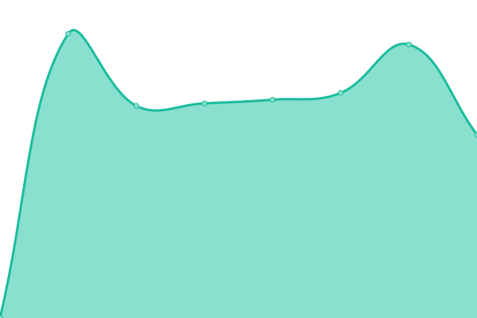
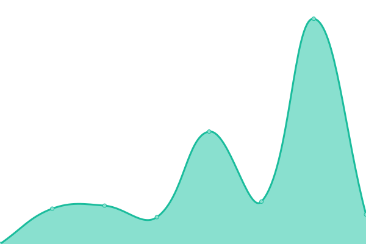

# [📈 Live Status](https://municarrillo.github.io/status-site): <!--live status--> **🟩 All systems operational**

This repository contains the open-source uptime monitor and status page for [Municipalidad de Carrillo](https://www.municarrillo.go.cr), powered by [Upptime](https://github.com/upptime/upptime).

With [Upptime](https://upptime.js.org), you can get your own unlimited and free uptime monitor and status page, powered entirely by a GitHub repository. We use [Issues](https://github.com/municarrillo/status-site/issues) as incident reports, [Actions](https://github.com/municarrillo/status-site/actions) as uptime monitors, and [Pages](https://municarrillo.github.io/status-site) for the status page.

<!--start: status pages-->
<!-- This summary is generated by Upptime (https://github.com/upptime/upptime) -->
<!-- Do not edit this manually, your changes will be overwritten -->
<!-- prettier-ignore -->
| URL | Status | History | Response Time | Uptime |
| --- | ------ | ------- | ------------- | ------ |
|  [Municarrillo](https://www.municarrillo.go.cr) | 🟩 Up | [municarrillo.yml](https://github.com/municarrillo/status-site/commits/HEAD/history/municarrillo.yml) | 

 958ms
     
 | 

<a href="https://municarrillo.github.io/status-site/history/municarrillo">100.00%</a>
    

|  [Visor Cartografico Carrillo](https://visorcartografico.municarrillo.go.cr) | 🟩 Up | [visor-cartografico-carrillo.yml](https://github.com/municarrillo/status-site/commits/HEAD/history/visor-cartografico-carrillo.yml) | 

 649ms
     
 | 

<a href="https://municarrillo.github.io/status-site/history/visor-cartografico-carrillo">100.00%</a>
    

|  [Visados Carrillo](https://visadosweb.municarrillo.go.cr) | 🟩 Up | [visados-carrillo.yml](https://github.com/municarrillo/status-site/commits/HEAD/history/visados-carrillo.yml) | 

 485ms
     
 | 

<a href="https://municarrillo.github.io/status-site/history/visados-carrillo">100.00%</a>
    

|  [Google](https://www.google.com) | 🟩 Up | [google.yml](https://github.com/municarrillo/status-site/commits/HEAD/history/google.yml) | 

 98ms
     
 | 

<a href="https://municarrillo.github.io/status-site/history/google">100.00%</a>
    

<!--end: status pages-->

[**Visit our status website →**](https://municarrillo.github.io/status-site)

## 📄 License

- Powered by: [Upptime](https://github.com/upptime/upptime)
- Code: [MIT](./LICENSE) © [Municipalidad de Carrillo](https://www.municarrillo.go.cr)
- Data in the `./history` directory: [Open Database License](https://opendatacommons.org/licenses/odbl/1-0/)
